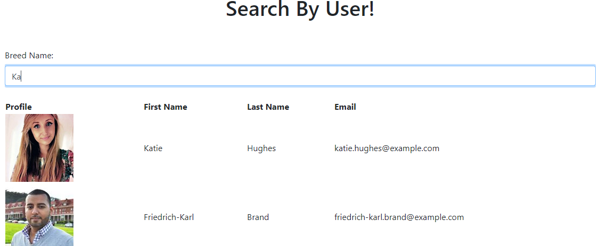

# user-directory :busts_in_silhouette:

## Table of Contents :file_folder:
- [Description](#description)
- [Tests](#tests)
- [Technology](#technology)
- [Contributors](#contributors)
- [Contact](#contact)

## Description :book:
  You're tired of trudging through pages upon pages of directory information when all you need is a simple email, or information sorted in a specific pattern. User-directory is here to help! Feel free to search or sort critical information and find results faster than the speed of paint drying. We've utilized a custom state-of-the-art dummy API that generates completely fictional data for your browsing and testing purposes. 

## Tests :bar_chart:
Simply follow the link to our deployed app (kudos to Heroku) and experience the magic!

### :calendar: ########### :runner:

## Technology :computer:

- Node.js
- React.js
- JavaScript
- Axios (dummyAPI-- literally)

## Contributors :milky_way:

Get to know our engineer & keep up with the latest updates via GitHub:

 

 
Cooper Ahearn - HR & Public Affairs; Auxiliary Support

## Contact :email:

Connect with & contact the engineer directly via LinkedIn:

:cd: Cooper - <a href="https://www.linkedin.com/in/lcahearn/">LCAhearn</a> :cd: 